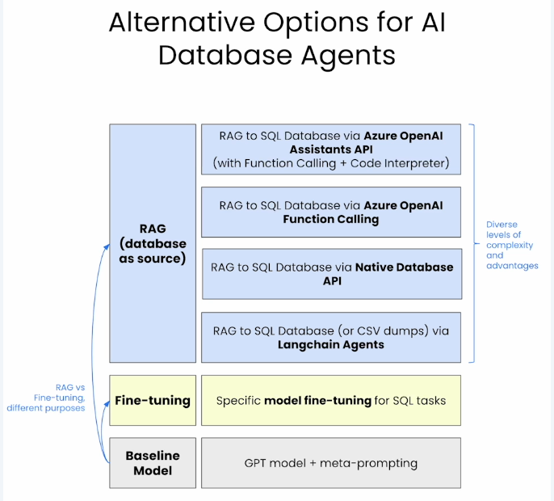
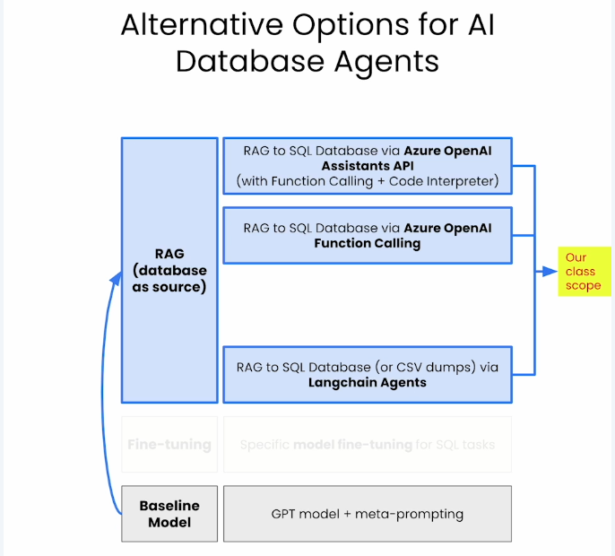
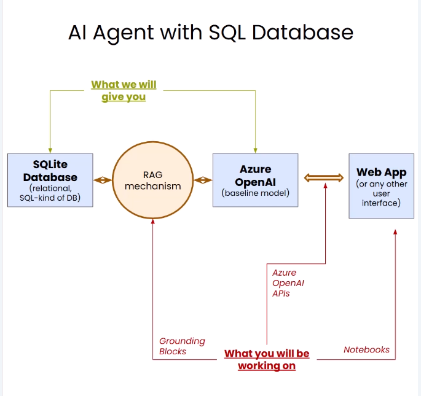

# Building your own database ai agent


## Ways to "cutomize" LLMs

- RAG / Grounding

- Fine tuning

## Interacting with CSV data





RAG to SQL database via different options.

Design your prompt and ask your question
3 pieces of information: prefix, suffix, and question:


CSV_PROMPT_PREFIX = """
First set the pandas display options to show all the columns,
get the column names, then answer the question.
"""

CSV_PROMPT_SUFFIX = """
- **ALWAYS** before giving the Final Answer, try another method.
Then reflect on the answers of the two methods you did and ask yourself if it answers correctly the original question. If you are not sure, try another method.
- If the methods tried do not give the same result,reflect and try again until you have two methods that have the same result.
- If you still cannot arrive to a consistent result, say that you are not sure of the answer.
- If you are sure of the correct answer, create a beautiful and thorough response using Markdown.
- **DO NOT MAKE UP AN ANSWER OR USE PRIOR KNOWLEDGE,
ONLY USE THE RESULTS OF THE CALCULATIONS YOU HAVE DONE**.
- **ALWAYS**, as part of your "Final Answer", explain how you got to the answer on a section that starts with: "\n\nExplanation:\n".
In the explanation, mention the column names that you used to get to the final answer.
"""

QUESTION = "How may patients were hospitalized during July 2020" 
"in Texas, and nationwide as the total of all states?"
"Use the hospitalizedIncrease column" 
"""

## Lesson 3: Connecting to a SQL database



https://learn.deeplearning.ai/courses/building-your-own-database-agent/lesson/zxmwc/connecting-to-a-sql-database


## Lesson 4: Azure OpenAI Function Calling Feature

Function calling:
- provides specific instructions to find information in the database
- prioritizes queries for precise results and desired output
- adds control and encapsulates queris for better structure and predictability

https://learn.deeplearning.ai/courses/building-your-own-database-agent/lesson/wdawr/azure-openai-function-calling-feature

A diferença é que function calling ajuda a tornar mais determinístico possível.

---
This notebook demonstrates how to use the Azure OpenAI Function Calling feature, allowing the language model to interact with external tools and APIs. It presents two main examples: first, a simple weather API, and second, a more complex interaction with a SQL database.

### 1. Setup and Illustrative Weather Example

The notebook begins by setting up the Azure OpenAI client using environment variables for the API key and endpoint.

It then introduces a simple `get_current_weather` function that simulates fetching weather data for specific locations. This function returns a JSON string with location, temperature, and unit.

To enable the Azure OpenAI model to use this function, a `tools` list is defined. This list specifies the function's name (`get_current_weather`), a description, and its parameters, including their types and descriptions (e.g., `location` as a string, `unit` as an enum of "fahrenheit" or "celsius"). The `tool_choice="auto"` setting allows the model to decide whether to call a function or respond directly.

The notebook then shows how to make a chat completion request to the Azure OpenAI model. If the model determines that a tool call is necessary, it provides the `tool_calls` in its response. The code then extracts the function name and arguments from the `tool_calls`, executes the corresponding local Python function (e.g., `get_current_weather`), and appends the function's response back to the messages list with the role "tool". Finally, a second API call is made to the model with the updated messages, allowing it to generate a natural language response based on the tool's output.

### 2. Interacting with a SQL Database

The second part of the notebook demonstrates a more practical application by connecting to a SQL database. It first creates a Pandas DataFrame from a CSV file (`all-states-history.csv`) and then loads this data into an SQLite database named `test.db` using SQLAlchemy.

Two Python functions are defined to interact with this database:
* `get_hospitalized_increase_for_state_on_date(state_abbr, specific_date)`: This function queries the database to get the daily increase in hospitalizations for a given state and date.
* `get_positive_cases_for_state_on_date(state_abbr, specific_date)`: This function retrieves the daily increase in positive COVID-19 cases for a specific state and date.

Similar to the weather example, a `tools_sql` list is created, describing these two SQL-querying functions, their descriptions, and their required parameters (`state_abbr` and `specific_date`).

The process for using function calling with the SQL database is identical to the weather example:
1.  A user message is sent to the Azure OpenAI model.
2.  The model, using the defined `tools_sql`, determines which function to call and provides the necessary arguments.
3.  The Python code executes the recommended function (e.g., `get_hospitalized_increase_for_state_on_date`) with the extracted arguments.
4.  The result from the database query is appended back to the messages.
5.  A second call to the Azure OpenAI model is made, allowing it to formulate a human-readable response based on the data retrieved from the SQL database.

Overall, the notebook illustrates the power of Azure OpenAI's function calling feature in enabling language models to perform actions and retrieve information from external systems by dynamically selecting and executing predefined tools.

## Lesson 5: Leveraging Assistants API for SQL Databases

With Assistants API, you can create a more complex agent that can use multiple tools and chain them together.
It could also mantain the state (context) of the conversation.

You can use code interpreter to execute code in the agent. 

---

This notebook, "Lesson 5: Leveraging Assistants API for SQL Databases," is a fantastic follow-up to the previous lesson on function calling. It takes the concept of giving an LLM external capabilities a step further by introducing the Azure OpenAI Assistants API. Think of the Assistants API as a more advanced framework that simplifies the orchestration of complex interactions, including tool use and even code interpretation, without you having to manually manage all the back-and-forth steps.

Here's a gracious breakdown of what's happening in this notebook:

The Big Picture: Why Assistants API?

In the previous lesson, you manually managed the entire lifecycle of a tool call: you sent a message, received a tool call from the model, executed the function yourself, and then sent the function's output back to the model. The Assistants API automates much of this, allowing you to define an "assistant" with specific instructions and tools, and then let it manage conversations (threads) and tool executions more autonomously.

1. Setup and Helper Functions

The notebook starts by importing necessary libraries and, notably, a Helper.py file. This Helper.py file is crucial because it contains the Python functions (get_positive_cases_for_state_on_date and get_hospitalized_increase_for_state_on_date) and their corresponding tool definitions (Helper.tools_sql) from your previous lesson, which allow interaction with the SQL database. This means the data setup and the functions for querying the COVID dataset are already prepared.

2. Launching the Assistant API

This is where the magic begins:

    Creating an Assistant: You create an assistant instance using client.beta.assistants.create().

        instructions: This is the high-level "persona" and goal for your assistant. Here, it's instructed to be "an assistant answering questions about a Covid dataset". This is like setting the overall context and behavior for your AI.

        model: You specify which GPT model the assistant should use, like gpt-4-1106.

        tools: This is where you connect your predefined functions. You pass Helper.tools_sql to the assistant, giving it the knowledge of how to interact with your SQL database.

    Creating a Thread: Conversations with an assistant happen within a thread. You create an empty thread using client.beta.threads.create(). This thread will keep a history of all messages and assistant actions.

3. Interacting with the Assistant (with Function Calling)

Now that the assistant and thread are set up, you can have a conversation:

    Adding a User Message: You add your question to the thread using client.beta.threads.messages.create(). For example: "how many hospitalized people we had in Alaska the 2021-03-05?".

    Running the Assistant: You initiate a run on the thread with your assistant using client.beta.threads.runs.create(). This tells the assistant to process the latest message(s) in the thread and decide what to do.

4. Handling requires_action Status (The Automated Part)

This is a key difference from the previous lesson:

    The code enters a loop to continuously retrieve the run status.

    If the status becomes "requires_action", it means the assistant has determined it needs to call one or more of your provided tools (functions) to answer the user's question.

    Inside this if block, your code manually performs the actual function execution:

        It identifies which functions the assistant wants to call and with what arguments.

        It executes these local Python functions (get_positive_cases_for_state_on_date or get_hospitalized_increase_for_state_on_date).

        Crucially, it then uses client.beta.threads.runs.submit_tool_outputs() to send the results of these function calls back to the assistant. This is the "missing piece" that allows the assistant to continue processing after an external tool has been used.

    The loop continues until the run status is "completed" or an error state is reached.

Once the run is completed, you can retrieve and print all messages in the thread to see the assistant's final answer, which now incorporates the data obtained from your SQL database.

5. Adding the Code Interpreter

This section introduces another powerful built-in tool of the Assistants API: the code_interpreter.

    Instead of custom SQL functions, you now upload your all-states-history.csv file directly to the assistant.

    When creating the assistant, you specify tools=[{"type": "code_interpreter"}].

    Now, when you ask a question like "how many hospitalized people we had in Alaska the 2021-03-05?", the assistant, using its code interpreter, can actually write and execute Python code internally to read the CSV, filter the data, and find the answer, all without you providing specific SQL functions. This is a higher level of abstraction and automation for data analysis tasks.

In summary, this notebook elegantly shows how the Azure OpenAI Assistants API streamlines the creation of conversational AI agents by managing conversation history and orchestrating tool usage (both custom functions and built-in tools like the code interpreter), making it much easier to build sophisticated applications that interact with external data and services.


## Best practices: metadata for tools

Creating structured metadata for tools in agentic systems is critical for empowering Large Language Models (LLMs) to effectively use external functionalities. Here are some best practices, drawing from the provided notebook and general principles of designing AI agents:

1.  **Clear and Concise `name`:**
    * The `name` of your function should be intuitive and directly reflect what the function does (e.g., `get_current_weather`, `get_hospitalized_increase_for_state_on_date`).
    * Avoid overly generic names that could be ambiguous to the LLM.

2.  **Comprehensive `description`:**
    * This is arguably the most important piece of metadata. It's the primary way you "prompt" the LLM about the tool's purpose and when to use it.
    * **Be explicit:** Clearly state what the function does, its capabilities, and any key assumptions or limitations.
    * **Contextualize:** Explain the *purpose* of the function in a way that aligns with potential user queries. For example, "Get the current weather in a given location. The default unit when not specified is fahrenheit".
    * **Hint at trigger phrases:** While not explicitly shown in the notebook's example, it's good practice to implicitly suggest keywords or phrases that might trigger the use of this tool.
    * **Specify when *not* to use it (if applicable):** For tools that might be overused, adding conditions for when *not* to invoke them can be helpful.

3.  **Precise `parameters` (Schema Definition):**
    * **Type and Description for each parameter:** Just like in the notebook, define the `type` (e.g., "string", "number", "boolean") for each parameter. Crucially, provide a clear `description` for each parameter so the LLM understands what kind of information it needs to extract from the user's prompt (e.g., `location`: "The city and state, e.g. San Francisco, CA").
    * **`required` fields:** Explicitly list which parameters are mandatory for the function to execute successfully. This helps the LLM know when it needs to ask clarifying questions if information is missing.
    * **`enum` for constrained values:** If a parameter has a limited set of possible values (like `unit` in the weather example), use `enum` to specify these. This guides the LLM to use valid inputs and avoids "hallucinating" incorrect values.
    * **`default` values:** If a parameter has a default, specify it. This allows the LLM to call the function even if the user doesn't explicitly provide that parameter, relying on the default.

4.  **Single Responsibility Principle:**
    * Each tool should ideally perform one specific, well-defined operation. Avoid creating "god functions" that try to do too many things. This makes it easier for the LLM to understand and correctly utilize the tool.
    * If a complex task requires multiple steps, break it down into smaller, atomic tools that the LLM can chain together.

5.  **Return Structured Data from Tools:**
    * Tools should return well-typed, structured data (e.g., JSON) that LLMs can easily parse and reason about. The notebook's examples of returning JSON strings illustrate this well.
    * Avoid returning free-form text from tools, as it's harder for the LLM to reliably extract specific pieces of information.

6.  **Stateless and Reusable Tools:**
    * Design tools to be stateless and reusable across different tasks. They should produce the same output for the same input, regardless of previous calls.

7.  **Error Handling and Validation:**
    * While not explicitly shown in the metadata, the underlying function should have robust error handling. The LLM should be able to receive and interpret tool errors (e.g., returning `np.nan` and handling it). This allows the LLM to potentially take corrective action or inform the user about the failure.
    * Input validation within the tool functions themselves is also crucial to ensure data integrity and prevent unexpected behavior.

8.  **Iterative Refinement and Testing:**
    * Design prompts that efficiently communicate context and instructions.
    * Continuously test how the LLM interacts with your tools using various user inputs. This helps identify misunderstandings or edge cases in your tool definitions and allows for iterative refinement.
    * Think of the tool definition as a "docstring for a junior developer on your team" – it should be so clear that anyone (or any LLM) can understand how to use it.

---

Here are a couple of examples illustrating best practices for creating structured metadata for tools in agentic systems:

### Example 1: `manage_calendar_event`

This tool allows the agent to create, update, or delete calendar events.

```json
{
    "type": "function",
    "function": {
        "name": "manage_calendar_event",
        "description": "Manages calendar events, including creating new events, updating existing ones, or deleting them. This tool should be used when the user explicitly expresses intent to schedule, reschedule, cancel, or modify a meeting, appointment, or event.",
        "parameters": {
            "type": "object",
            "properties": {
                "action_type": {
                    "type": "string",
                    "description": "The type of action to perform on the calendar event. 'create' for new events, 'update' for changing existing events, 'delete' for removing events.",
                    "enum": ["create", "update", "delete"]
                },
                "event_id": {
                    "type": "string",
                    "description": "The unique identifier of the event to update or delete. Required only for 'update' or 'delete' actions. Not needed for 'create'.",
                    "nullable": true
                },
                "title": {
                    "type": "string",
                    "description": "The title or subject of the calendar event. Required for 'create' and 'update' actions.",
                    "nullable": true
                },
                "start_time": {
                    "type": "string",
                    "description": "The start date and time of the event in 'YYYY-MM-DD HH:MM' format. Required for 'create' and 'update' actions.",
                    "pattern": "^\\d{4}-\\d{2}-\\d{2} \\d{2}:\\d{2}$",
                    "nullable": true
                },
                "end_time": {
                    "type": "string",
                    "description": "The end date and time of the event in 'YYYY-MM-DD HH:MM' format. Must be after the start_time. Required for 'create' and 'update' actions.",
                    "pattern": "^\\d{4}-\\d{2}-\\d{2} \\d{2}:\\d{2}$",
                    "nullable": true
                },
                "attendees": {
                    "type": "array",
                    "items": {
                        "type": "string",
                        "format": "email",
                        "description": "Email address of an attendee to invite to the event."
                    },
                    "description": "A list of email addresses of people to invite to the event. Optional for all actions."
                },
                "location": {
                    "type": "string",
                    "description": "The physical location where the event will take place. Optional for all actions.",
                    "nullable": true
                },
                "description": {
                    "type": "string",
                    "description": "A detailed description or agenda for the event. Optional for all actions.",
                    "nullable": true
                }
            },
            "required": ["action_type"]
        }
    }
}
```

**Why this is a good example:**

  * **Clear `name`:** `manage_calendar_event` clearly indicates its purpose.
  * **Comprehensive `description`:** It explains what the tool does, when to use it, and provides examples of user intent that should trigger it. It also hints at when *not* to use it by focusing on explicit intent.
  * **Precise `parameters`:**
      * `action_type` uses an `enum` for constrained, valid values (`create`, `update`, `delete`).
      * `event_id` clarifies its necessity based on `action_type`.
      * `title`, `start_time`, `end_time` are clearly marked as required for certain `action_type`s.
      * `start_time` and `end_time` include `pattern` for expected format, guiding the LLM to extract dates and times correctly.
      * `attendees` specifies an `array` of `email` format strings, showing how to handle lists and specific data types.
      * Each parameter has a descriptive explanation.
      * `nullable: true` is used where parameters are optional, providing clear guidance to the LLM.
  * **Single Responsibility Principle (within context):** While it handles create/update/delete, these are tightly related operations on a single entity (calendar event), making it a logical grouping.

-----

### Example 2: `get_product_information`

This tool allows the agent to retrieve details about a specific product from an inventory system.

```json
{
    "type": "function",
    "function": {
        "name": "get_product_information",
        "description": "Retrieves detailed information about a product, such as its price, availability, description, or specifications. Use this tool when a user asks about a specific product's details or properties. Do not use if the user is asking to place an order or check order status.",
        "parameters": {
            "type": "object",
            "properties": {
                "product_identifier": {
                    "type": "string",
                    "description": "The unique identifier for the product. This can be a product name, SKU, or model number.",
                    "minLength": 3
                },
                "detail_level": {
                    "type": "string",
                    "description": "Specifies the level of detail to retrieve for the product. 'summary' provides basic info, 'full' provides all available details.",
                    "enum": ["summary", "full"],
                    "default": "summary"
                }
            },
            "required": ["product_identifier"]
        }
    }
}
```

**Why this is a good example (highlighting different variables):**

  * **Clear `name`:** `get_product_information` is direct and descriptive.
  * **Comprehensive `description`:** Explains the tool's purpose and, importantly, includes a clear instruction on when *not* to use it ("Do not use if the user is asking to place an order or check order status."), preventing the LLM from misinterpreting intent.
  * **Precise `parameters`:**
      * `product_identifier` has `minLength` to guide the LLM on valid inputs.
      * `detail_level` uses `enum` and a `default` value. This means if the user asks "What about the 'SuperWidget'?", the LLM can still call the function, defaulting to "summary" detail. If the user asks "Give me full details on 'SuperWidget'", the LLM will provide "full" for `detail_level`.
      * `required` clearly states that a `product_identifier` is always needed.
  * **Stateless and Reusable:** This function is inherently stateless; it simply retrieves information based on input, without altering system state.


## API Assistants vs Multi-Agent Systems

While both API Assistants (like Azure OpenAI's Assistants API) and flow orchestration multi-agent systems aim to solve complex tasks using AI, they differ significantly in their architecture, level of abstraction, and the amount of control and customization they offer.

Here's a breakdown of how they differ:

API Assistants (e.g., Azure OpenAI Assistants API)

API Assistants provide a higher-level, managed service for building AI applications. They abstract away much of the complexity of managing conversation state and orchestrating tool calls.

    Managed Abstraction: You define an "assistant" with a specific persona (instructions), a model, and a set of tools. The API then handles the internal logic of deciding when to call a tool, managing the conversation history within a "thread," and even re-invoking the model after tool outputs are provided.

    Built-in Orchestration: The core orchestration (e.g., deciding which tool to use, requesting user input for missing parameters, generating a final response) is handled by the API itself. You primarily interact by adding messages to a thread and running the assistant, then handling any requires_action states where your code needs to execute external tools.

    Focus on Single Assistant: While an assistant can use multiple tools, the interaction model typically revolves around a single, cohesive assistant persona interacting with a user.

    Simpler Tool Integration: Integrating tools is relatively straightforward; you provide a schema (like the tools_sql in the notebook) and the API handles the LLM's understanding and invocation of these tools.

    Limited Customization of Internal Flow: You have less granular control over the internal decision-making process of the LLM itself (e.g., how it decides between tools, or its reasoning steps). You primarily influence it through instructions and tool descriptions.

    Example from Notebook: The L5 notebook demonstrates this: you define an assistant for a Covid dataset, give it SQL-querying tools, and it largely handles figuring out how to answer questions by using those tools. It even automates the code interpreter.

Flow Orchestration Multi-Agent Systems

These systems offer a more decentralized and highly customizable approach, often involving multiple, specialized AI agents collaborating to achieve a goal.

    Decentralized Control & Collaboration: Instead of one central "assistant," you define multiple distinct "agents," each with its own role, capabilities (tools), and perhaps even its own LLM instance or specialized prompt. These agents then communicate and pass information between themselves to solve a problem.

    Explicit Flow Definition: The "flow orchestration" comes into play because you explicitly design the interaction sequence and decision logic between these agents. This might involve:

        Sequencing: Agent A performs a task, then passes its output to Agent B.

        Conditional Logic: If Agent A's output meets certain criteria, then Agent B is invoked; otherwise, Agent C.

        Parallelism: Multiple agents work in parallel on sub-tasks.

        Looping: An agent might repeatedly refine a solution or query until a condition is met.

    Fine-Grained Control: You have much finer control over the entire process. You define each agent's behavior, how they interact, what triggers their actions, and how their outputs are combined. This often involves writing more explicit code to manage the state and transitions between agents.

    Complex Tool Orchestration: While each agent might have its own tools, the orchestration involves managing which agent calls which tool, and how the results from one agent's tool call influence another agent's actions.

    Use Cases: Ideal for highly complex tasks that require breaking down problems into sub-problems, assigning them to specialized agents, and coordinating their efforts, or when you need very specific control over the problem-solving methodology. For example:

        A "Research Agent" gathers information, passes it to an "Analysis Agent," which then passes insights to a "Reporting Agent."

        A "Customer Support Agent" identifies the problem, then hands off to a "Troubleshooting Agent" or a "Sales Agent" depending on the issue.

Key Differences Summarized:

| Feature	| API Assistants (e.g., Azure OpenAI Assistants API)	| Flow Orchestration Multi-Agent Systems
| --- | --- | --- |
| Abstraction	| High-level; API manages internal orchestration & state	| Low-level; explicit coding for orchestration & state management |
| Control	| Less granular; influence via instructions & tool descriptions	| Highly granular; explicit logic for agent interactions & flow |
| Agent Count	| Typically a single, overarching assistant	| Multiple, specialized, collaborating agents |
| Complexity	| Simpler to set up for common tasks involving tool use	| Higher initial complexity due to explicit flow design |
| Flexibility	| Good for general conversational agents with defined tools	| Excellent for complex workflows, dynamic task decomposition, and team-based problem-solving |
| Development	| More configuration-based; less custom code for orchestration	| More code-based for defining agent logic and inter-agent communication |


In essence, if you need a smart, tool-using chatbot that manages its own conversation flow and tool invocation, API Assistants are an excellent choice due to their ease of use and managed nature. If your problem requires breaking down a task into sub-tasks handled by different specialized AI components that communicate in a structured, custom-defined manner, then a flow orchestration multi-agent system provides the necessary architectural flexibility.


## References

[create_pandas_dataframe_agent — 🦜🔗 LangChain documentation](https://python.langchain.com/api_reference/experimental/agents/langchain_experimental.agents.agent_toolkits.pandas.base.create_pandas_dataframe_agent.html)


https://python.langchain.com/api_reference/experimental/sql/langchain_experimental.sql.base.SQLDatabaseChain.html


https://platform.openai.com/docs/assistants/overview


https://platform.openai.com/docs/guides/responses-vs-chat-completions


https://learn.microsoft.com/en-us/azure/ai-foundry/openai/how-to/function-calling

